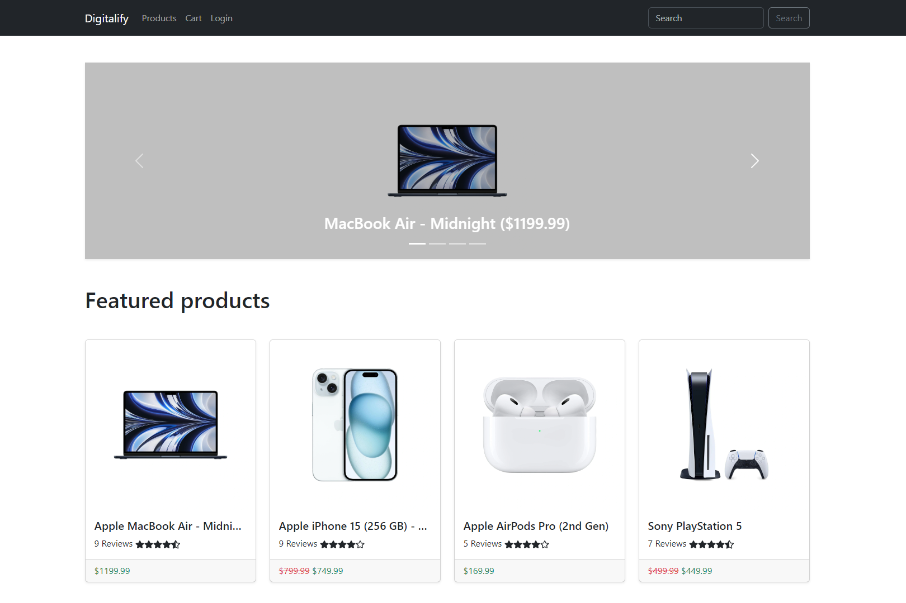

# Digitalify

> E-commerce platform built with the MERN (MongoDB, Express.js, React, Node.js) stack & Redux Toolkit.



Digitalify is an e-commerce web app built with the MERN (MongoDB, Express.js, React, Node.js) stack & Redux Toolkit.

<!-- toc -->

- [Features](#features)
- [Usage](#usage)
  - [Env Variables](#env-variables)
  - [Install Dependencies](#install-dependencies)
  - [Seed Database](#seed-database)
  - [Run](#run)

<!-- tocstop -->

## Features

- Advanced Product search feature
- Product pagination
- Full featured shopping cart
- User profile with orders & order details page
- Checkout process (shipping, payment method, etc)
- Admin panel page
- Admin category, product, user & order management
- Admin mark orders as delivered and paid features
- Database seeder (category, products & users)

## Usage

- You should have node.js installed [Node.js](https://nodejs.org)
- To create a MongoDB database [MongoDB](https://www.mongodb.com)

### Env Variables

Rename `.env.example` to `.env` in both frontend & backend folders and add your env variables.

### Install Dependencies

Open a terminal

```
cd backend
npm install
cd ..
cd frontend
npm install
```

### Seed Database

Open a terminal

```
cd backend
npm run seed
```

### Run

Open a terminal

```
cd backend
npm run dev
```

Open a new terminal

```
cd frontend
npm run dev
```
